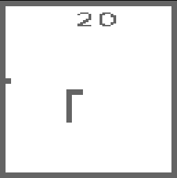

#Snake Clone
=================

A Snake clone written in C and using the SDL Graphics Library

#Controls:
=================
Arrow Keys - Move Snake to direction 
Space Bar - New Game
	
#Screenshot:
=================

